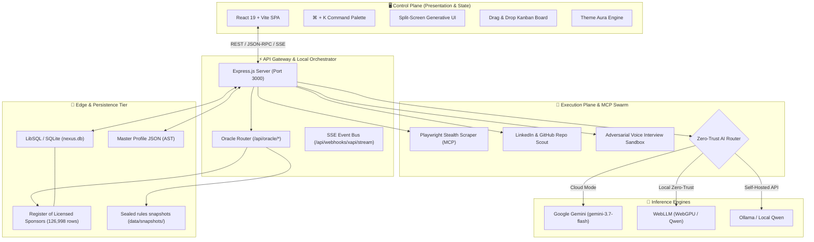

# ⚛️ CHERENKOV-NEXUS: Autonomous Career Intelligence Hub

<div align="center">

```
   ██████╗██╗  ██╗███████╗██████╗ ███████╗███╗   ██╗██╗  ██╗ ██████╗ ██╗   ██╗
  ██╔════╝██║  ██║██╔════╝██╔══██╗██╔════╝████╗  ██║██║ ██╔╝██╔═══██╗██║   ██║
  ██║     ███████║█████╗  ██████╔╝█████╗  ██╔██╗ ██║█████╔╝ ██║   ██║██║   ██║
  ██║     ██╔══██║██╔══╝  ██╔══██╗██╔══╝  ██║╚██╗██║██╔═██╗ ██║   ██║╚██╗ ██╔╝
  ╚██████╗██║  ██║███████╗██║  ██║███████╗██║ ╚████║██║  ██╗╚██████╔╝ ╚████╔╝ 
   ╚═════╝╚═╝  ╚═╝╚══════╝╚═╝  ╚═╝╚══════╝╚═╝  ╚═══╝╚═╝  ╚═╝ ╚═════╝   ╚═══╝  
                                   N E X U S
```

[](https://opensource.org/licenses/MIT)
[](https://nodejs.org)
[](https://react.dev)
[](https://www.typescriptlang.org)
[](https://playwright.dev)
[](https://tailwindcss.com)
[](https://modelcontextprotocol.io)

**A local-first desktop workspace for engineers pursuing UK visa-sponsored roles — built around a sponsorship eligibility oracle that gives reproducible, auditable verdicts instead of guesses.**

[⚖️ The Sponsorship Oracle](docs/ORACLE.md) • [🚀 Quickstart](docs/QUICKSTART.md) • [📐 Architecture](docs/ARCHITECTURE.md) • [📚 Documentation Portal](docs/README.md) • [🧪 E2E Testing](docs/E2E_TESTING.md) • [🗺️ Roadmap](docs/ROADMAP.md)

</div>

---

## ⚖️ Start here: the Sponsorship Eligibility Oracle

Most tools tell you a company "sponsors visas". That is not the question. The question is whether
*this role, at this salary,* clears the rules — and if not, **which single requirement is the one
that fails.**

The Oracle answers that, and shows its working:

> **NOT ELIGIBLE** — Monzo Bank is on the Register of Licensed Sponsors, and £44,000 clears the
> £41,700 general salary threshold. It does not clear the **going rate for SOC 2136 (£49,400)**.
> That is the **binding constraint** — rule `SW 14.2`.
> *Provisional — assessed against unverified rules snapshot `uk-skilled-worker-2026-08-14`.*

Four properties make that verdict trustworthy, and each is locked by
[`e2e/oracle.spec.ts`](e2e/oracle.spec.ts):

1. **It names the binding constraint.** Not a score, not a probability — the specific rule that
   fails, with the two numbers being compared and the rule reference.
2. **It is checked against the real register.** All **126,998** rows of the UK Home Office Register
   of Licensed Sponsors, held locally in SQLite — not a curated sample.
3. **It cites a content-addressed rules snapshot.** Verdicts are evaluated against a sealed
   snapshot (`uk-skilled-worker-2026-08-14+a8d94f73543a`); `npm run oracle:seal:check` fails CI if
   its contents drift from its hash.
4. **It admits what it does not know.** Every verdict is marked **PROVISIONAL** while the shipped
   snapshot is unverified against primary sources. The product declines to overstate rather than
   rounding up to confidence.

The same posting and snapshot produce the same verdict every time. See [`docs/ORACLE.md`](docs/ORACLE.md)
for the rule ledger and the deliberately narrow V1 scope (UK Skilled Worker route only).

---

## 🌟 What else is in the box

**CHERENKOV-NEXUS** is a local-first desktop application (React 19 + Express, packaged with Tauri)
for engineers targeting visa-sponsored roles in the UK and EU. Around the Oracle it adds:

1. **Zero-Trust Privacy Routing:** On-device WebGPU (`@mlc-ai/web-llm`) and local Ollama failover,
   so candidate PII need never leave the machine. Where no inference engine is configured, features
   that would need one say so rather than generating a plausible-looking answer.
2. **Stateless Model Context Protocol (MCP):** Built against the `2026-07-28` MCP specification for
   scraping, ATS parsing, and LLM orchestration.
3. **Living Master Profile Synchronization:** A Learning Record Store listening for **xAPI**
   webhooks from Coursera, Udemy, and Pluralsight.

---

## 🏗️ High-Level System Architecture



---

## ⚡ Core Capabilities

| Module | Core Functionality | Primary Tech / Endpoint |
|---|---|---|
| ⚖️ **[Sponsorship Oracle](docs/ORACLE.md)** | Reproducible UK Skilled Worker verdicts naming the binding constraint, cited to a sealed rules snapshot | `POST /api/oracle/verdict` |
| 🎯 **Job Synthesizer** | Splits job posting into Reality vs Tailored AST Layer; generates ATS answers & cover letters | `POST /api/synthesize` |
| 🛡️ **Visa Sponsor Verifier** | Deterministic fuzzy lookup against official UK/EU government registries | `POST /api/visa-check` |
| 🔄 **xAPI Learning Sync** | Autonomous competency ingestion from external LMS platforms via webhook | `POST /api/webhooks/xapi` |
| 🕵️ **LinkedIn & Repo Scout** | Maps hiring managers & analyzes target open-source repositories | `POST /api/mcp/linkedin-scout` |
| 🎙️ **Voice Interview Sandbox** | Adversarial technical interview simulation. Scores answers when an inference engine is configured, and declines to score when none is — it will not invent a mark | `POST /api/interview/generate-questions` |
| 🔐 **Identity Vault** | Zero-Trust PII masking & seamless switching between Cloud / Local WebGPU AI | `@mlc-ai/web-llm` / WebGPU |
| 📋 **Live Kanban Board** | State-persisted multi-stage application pipeline | `GET /api/kanban/state` |
| ⚖️ **Model Compare Engine** | Real-time benchmarking between cloud Gemini and a local Ollama/Qwen model (default qwen2.5-coder:7b-instruct) | `POST /api/synthesize/compare` |

---

## 🚀 Quickstart Guide (Windows / PowerShell)

> [!IMPORTANT]
> Cherenkov Nexus runs seamlessly on Windows PowerShell, Linux, and macOS. Always use `;` for command chaining in PowerShell.

### 1. Clone & Install Dependencies
```powershell
git clone https://github.com/moaidmoatasem/cherenkov-nexus.git
cd cherenkov-nexus
npm install
```

### 2. Configure Environment Variables
Copy `.env.example` to `.env`:
```powershell
cp .env.example .env
```
Populate your `.env` file:
```env
PORT=3000
GEMINI_API_KEY="your-google-gemini-api-key"
TURSO_DATABASE_URL="your-turso-db-url-optional"
TURSO_AUTH_TOKEN="your-turso-token-optional"
LOCAL_LLM_ENDPOINT="http://localhost:11434/v1"
LOCAL_LLM_MODEL_NAME="qwen2.5-coder:7b-instruct"
```

> [!NOTE]
> The local-inference variable is `LOCAL_LLM_ENDPOINT`. Earlier revisions of this README named it
> `LOCAL_LLM_URL`, which the server has never read.

### 3. Seed the Edge Database
Initialize the local SQLite / LibSQL database containing the UK Home Office Licensed Sponsors:
```powershell
npx tsx seed-database.ts
```

### 4. Launch the Development Server
```powershell
npm run dev
```
Open **[http://localhost:3000](http://localhost:3000)** in your browser.

### 5. Execute via Standalone CLI
Tailor a resume and extract ATS answers directly from your terminal:
```powershell
npx tsx cherenkov.ts --url "https://careers.google.com/jobs/results/12345" --mode cloud
```

---

## 🧪 Comprehensive Testing Suite

Cherenkov Nexus features full End-to-End (E2E) automation via Playwright:

```powershell
# What CI gates on: every spec except the @live ones that hit third-party hosts
npm run test:e2e:ci

# Everything, including the @live specs (needs network to real services)
npm run test

# Run the comprehensive system & component suite with browser console mirroring
npx playwright test e2e/comprehensive-system.spec.ts

# Run UI workflow tests
npx playwright test e2e/ui.spec.ts

# Run CLI verification suite
npx playwright test e2e/cli.spec.ts
```

---

## 📁 Master Directory Structure

```text
cherenkov-nexus/
├── app/                        # Tauri v2 desktop application bundle
├── assets/                     # System icons and brand graphics
├── docs/                       # Complete Engineering & Architecture Documentation
│   ├── README.md               # Master Documentation Hub Index
│   ├── ARCHITECTURE.md         # Multi-Tiered Architecture Deep Dive
│   ├── SYSTEM_DESIGN.md        # Pipeline Sequence & Invariant Specifications
│   ├── ORACLE.md               # Sponsorship Eligibility Oracle — rules ledger & V1 scope
│   ├── AGENTS.md               # Agent roles & orchestration
│   ├── AI_ENGINE_MCP.md        # MCP 2026-07-28 & Structured Output Design
│   ├── INTEGRATIONS.md         # External Systems & Government Data Ingestion
│   ├── INTEGRATION_TESTING.md  # Integration Test Harnesses & Contracts
│   ├── E2E_TESTING.md          # Playwright Test Suite & Automation Guide
│   ├── DESIGN_SYSTEM.md        # UI/UX Ergonomics & Tailwind Theme Engine
│   ├── CODE_STANDARDS.md       # Clean Code, TypeScript & Architecture Rules
│   ├── CODE_OF_CONDUCT.md      # Contributor Covenant & Ethical AI Standards
│   ├── ROADMAP.md              # 6-Phase Strategic Evolution Plan
│   ├── DEVELOPMENT_PLAN.md     # Active Sprint & Task Tracking Matrix
│   ├── TASKS.md                # Comprehensive Action Item Catalog
│   ├── QUICKSTART.md           # Zero-Friction Developer Onboarding Guide
│   ├── FEATURES.md             # Complete 12-Module Feature Inventory
│   ├── TECH_STACK.md           # Exhaustive Technology & Version Matrix
│   ├── NORTHSTAR.md            # Vision, Success KPIs & Anti-Goals
│   └── HANDOVER.md             # Subagent Handover & Context Continuity Protocol
├── data/snapshots/             # Sealed, content-addressed rules snapshots
├── e2e/                        # Playwright Automated Test Suites
│   ├── oracle.spec.ts          # Verdict, binding constraint & reproducibility
│   ├── data-provenance.spec.ts # Headline figures must equal the records beneath them
│   ├── interview-honesty.spec.ts # No score is shown without a real assessment
│   ├── comprehensive-system.spec.ts
│   ├── fixtures.ts             # seedWorkspace() — specs state their own preconditions
│   ├── global-setup.ts
│   ├── cli.spec.ts
│   └── ui.spec.ts
├── server/                     # Backend Core & MCP Tool Implementations
│   └── mcp/
│       └── playwrightScraper.ts # Stealth ATS DOM & Accessibility Tree Extractor
├── scripts/                    # oracle-seal.ts and other maintenance scripts
├── tests/                      # Vitest unit suites (125 tests)
├── src/                        # React 19 Frontend Source
│   ├── oracle/                 # Eligibility engine, rules registry & snapshot sealing
│   ├── server/                 # Sponsor matching, integrations & MCP host
│   ├── components/             # Generative & Interactive UI Components
│   │   └── ui/                 # Shared design-system primitives (Button, Card, Badge...)
│   ├── data/                   # Default Master Profile & System Presets
│   ├── hooks/                  # Custom React Hooks (Theme, Hotkeys, SSE)
│   ├── utils/                  # AST Renderers & PDF Exporters
│   ├── App.tsx                 # Main Application Layout & State Router
│   ├── index.css               # Semantic design tokens & the 8 theme palettes
│   ├── main.tsx                # React DOM Mount Entrypoint
│   ├── navigation.tsx          # Workspace registry shared by sidebar, tabs & palette
│   └── types.ts                # Strict TypeScript Type Definitions
├── src-tauri/                  # Rust Native Backend Shell
├── cherenkov.ts                # Standalone CLI Ingestion & Synthesis Engine
├── masterProfile.json          # Master Candidate Identity AST
├── package.json                # Dependency Manifest & Scripts
├── playwright.config.ts        # Playwright Test Orchestrator Config
├── seed-database.ts            # LibSQL / SQLite Database Seeding Script
├── server.ts                   # Express API Gateway & Agent Controller
├── tsconfig.json               # TypeScript Compiler Configuration
└── vite.config.ts              # Vite Frontend Build Configuration
```

---

## 📜 Contributing & Code of Conduct

We welcome contributions! Please review our:
- [🤝 Contributing Guide](CONTRIBUTING.md)
- [📜 Code of Conduct](docs/CODE_OF_CONDUCT.md)
- [📐 Coding Standards](docs/CODE_STANDARDS.md)

---

## ⚖️ License
Released under the [MIT License](LICENSE). Built for high-velocity career autonomy.
