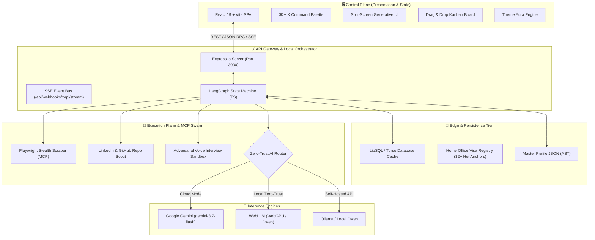

# ⚛️ CHERENKOV-NEXUS: Autonomous Career Intelligence Hub

<div align="center">

```
   ██████╗██╗  ██╗███████╗██████╗ ███████╗███╗   ██╗██╗  ██╗ ██████╗ ██╗   ██╗
  ██╔════╝██║  ██║██╔════╝██╔══██╗██╔════╝████╗  ██║██║ ██╔╝██╔═══██╗██║   ██║
  ██║     ███████║█████╗  ██████╔╝█████╗  ██╔██╗ ██║█████╔╝ ██║   ██║██║   ██║
  ██║     ██╔══██║██╔══╝  ██╔══██╗██╔══╝  ██║╚██╗██║██╔═██╗ ██║   ██║╚██╗ ██╔╝
  ╚██████╗██║  ██║███████╗██║  ██║███████╗██║ ╚████║██║  ██╗╚██████╔╝ ╚████╔╝ 
   ╚═════╝╚═╝  ╚═╝╚══════╝╚═╝  ╚═╝╚══════╝╚═╝  ╚═══╝╚═╝  ╚═╝ ╚═════╝   ╚═══╝  
                                   N E X U S
```

[](https://opensource.org/licenses/MIT)
[](https://nodejs.org)
[](https://react.dev)
[](https://www.typescriptlang.org)
[](https://playwright.dev)
[](https://tailwindcss.com)
[](https://modelcontextprotocol.io)

**A localized, agentic command center designed to transform the international tech career pipeline into a deterministically verifiable deployment engine.**

[🚀 Quickstart Guide](docs/QUICKSTART.md) • [📐 System Architecture](docs/ARCHITECTURE.md) • [📚 Documentation Portal](docs/README.md) • [🧪 E2E Testing](docs/E2E_TESTING.md) • [🗺️ Roadmap](docs/ROADMAP.md)

</div>

---

## 🌟 Executive Overview

**CHERENKOV-NEXUS** is an AI-orchestrated career warfare station built for Senior Engineers, QA Architects, and Technical Leaders targeting high-compensation, visa-sponsored roles across the UK, EU, and Global Remote markets.

Unlike probabilistic job scrapers or blind submission bots, **CHERENKOV-NEXUS** employs:
1. **Deterministic Verification:** Automatic verification against the **UK Home Office Register of Licensed Sponsors** and EU Blue Card registries using **LibSQL / Turso Edge** and local SQLite dictionaries.
2. **Zero-Trust Privacy Routing:** On-device WebGPU (`@mlc-ai/web-llm`) & local Ollama failover ensuring sensitive candidate PII never leaves the local machine.
3. **Stateless Model Context Protocol (MCP):** Full compliance with the official `2026-07-28` MCP specification for scraping, ATS parsing, and LLM orchestration.
4. **Living Master Profile Synchronization:** Real-time Learning Record Store (LRS) listening for **xAPI** webhooks from Coursera, Udemy, and Pluralsight.

---

## 🏗️ High-Level System Architecture



---

## ⚡ Core Capability Arsenal

| Module | Core Functionality | Primary Tech / Endpoint |
|---|---|---|
| 🎯 **Job Synthesizer** | Splits job posting into Reality vs Tailored AST Layer; generates ATS answers & cover letters | `POST /api/synthesize` |
| 🛡️ **Visa Sponsor Verifier** | Deterministic fuzzy lookup against official UK/EU government registries | `POST /api/visa-check` |
| 🔄 **xAPI Learning Sync** | Autonomous competency ingestion from external LMS platforms via webhook | `POST /api/webhooks/xapi` |
| 🕵️ **LinkedIn & Repo Scout** | Maps hiring managers & analyzes target open-source repositories | `POST /api/mcp/linkedin-scout` |
| 🎙️ **Voice Interview Sandbox** | Adversarial technical interview simulation with real-time scoring | `POST /api/interview/generate-questions` |
| 🔐 **Identity Vault** | Zero-Trust PII masking & seamless switching between Cloud / Local WebGPU AI | `@mlc-ai/web-llm` / WebGPU |
| 📋 **Live Kanban Board** | State-persisted multi-stage application pipeline | `GET /api/kanban/state` |
| ⚖️ **Model Compare Engine** | Real-time benchmarking between cloud Gemini and a local Ollama/Qwen model (default qwen2.5-coder:7b-instruct) | `POST /api/synthesize/compare` |

---

## 🚀 Quickstart Guide (Windows / PowerShell)

> [!IMPORTANT]
> Cherenkov Nexus runs seamlessly on Windows PowerShell, Linux, and macOS. Always use `;` for command chaining in PowerShell.

### 1. Clone & Install Dependencies
```powershell
git clone https://github.com/moaidmoatasem/cherenkov-nexus.git
cd cherenkov-nexus
npm install
```

### 2. Configure Environment Variables
Copy `.env.example` to `.env`:
```powershell
cp .env.example .env
```
Populate your `.env` file:
```env
PORT=3000
GEMINI_API_KEY="your-google-gemini-api-key"
TURSO_DATABASE_URL="your-turso-db-url-optional"
TURSO_AUTH_TOKEN="your-turso-token-optional"
LOCAL_LLM_URL="http://localhost:11434/v1"
```

### 3. Seed the Edge Database
Initialize the local SQLite / LibSQL database containing the UK Home Office Licensed Sponsors:
```powershell
npx tsx seed-database.ts
```

### 4. Launch the Development Server
```powershell
npm run dev
```
Open **[http://localhost:3000](http://localhost:3000)** in your browser.

### 5. Execute via Standalone CLI
Tailor a resume and extract ATS answers directly from your terminal:
```powershell
npx tsx cherenkov.ts --url "https://careers.google.com/jobs/results/12345" --mode cloud
```

---

## 🧪 Comprehensive Testing Suite

Cherenkov Nexus features full End-to-End (E2E) automation via Playwright:

```powershell
# Run the entire E2E test suite
npm run test

# Run the comprehensive system & component suite with browser console mirroring
npx playwright test e2e/comprehensive-system.spec.ts

# Run UI workflow tests
npx playwright test e2e/ui.spec.ts

# Run CLI verification suite
npx playwright test e2e/cli.spec.ts
```

---

## 📁 Master Directory Structure

```text
cherenkov-nexus/
├── app/                        # Tauri v2 desktop application bundle
├── assets/                     # System icons and brand graphics
├── docs/                       # Complete Engineering & Architecture Documentation
│   ├── README.md               # Master Documentation Hub Index
│   ├── ARCHITECTURE.md         # Multi-Tiered Architecture Deep Dive
│   ├── SYSTEM_DESIGN.md        # Pipeline Sequence & Invariant Specifications
│   ├── AGENTS.md               # LangGraph Agent Swarm Specifications
│   ├── AI_ENGINE_MCP.md        # MCP 2026-07-28 & Structured Output Design
│   ├── INTEGRATIONS.md         # External Systems & Government Data Ingestion
│   ├── INTEGRATION_TESTING.md  # Integration Test Harnesses & Contracts
│   ├── E2E_TESTING.md          # Playwright Test Suite & Automation Guide
│   ├── DESIGN_SYSTEM.md        # UI/UX Ergonomics & Tailwind Theme Engine
│   ├── CODE_STANDARDS.md       # Clean Code, TypeScript & Architecture Rules
│   ├── CODE_OF_CONDUCT.md      # Contributor Covenant & Ethical AI Standards
│   ├── ROADMAP.md              # 6-Phase Strategic Evolution Plan
│   ├── DEVELOPMENT_PLAN.md     # Active Sprint & Task Tracking Matrix
│   ├── TASKS.md                # Comprehensive Action Item Catalog
│   ├── QUICKSTART.md           # Zero-Friction Developer Onboarding Guide
│   ├── FEATURES.md             # Complete 12-Module Feature Inventory
│   ├── TECH_STACK.md           # Exhaustive Technology & Version Matrix
│   ├── NORTHSTAR.md            # Vision, Success KPIs & Anti-Goals
│   └── HANDOVER.md             # Subagent Handover & Context Continuity Protocol
├── e2e/                        # Playwright Automated Test Suites
│   ├── comprehensive-system.spec.ts
│   ├── cli.spec.ts
│   └── ui.spec.ts
├── server/                     # Backend Core & MCP Tool Implementations
│   └── mcp/
│       └── playwrightScraper.ts # Stealth ATS DOM & Accessibility Tree Extractor
├── src/                        # React 19 Frontend Source
│   ├── components/             # Generative & Interactive UI Components
│   │   └── ui/                 # Shared design-system primitives (Button, Card, Badge...)
│   ├── data/                   # Default Master Profile & System Presets
│   ├── hooks/                  # Custom React Hooks (Theme, Hotkeys, SSE)
│   ├── utils/                  # AST Renderers & PDF Exporters
│   ├── App.tsx                 # Main Application Layout & State Router
│   ├── index.css               # Semantic design tokens & the 8 theme palettes
│   ├── main.tsx                # React DOM Mount Entrypoint
│   ├── navigation.tsx          # Workspace registry shared by sidebar, tabs & palette
│   └── types.ts                # Strict TypeScript Type Definitions
├── src-tauri/                  # Rust Native Backend Shell
├── cherenkov.ts                # Standalone CLI Ingestion & Synthesis Engine
├── masterProfile.json          # Master Candidate Identity AST
├── package.json                # Dependency Manifest & Scripts
├── playwright.config.ts        # Playwright Test Orchestrator Config
├── seed-database.ts            # LibSQL / SQLite Database Seeding Script
├── server.ts                   # Express API Gateway & Agent Controller
├── tsconfig.json               # TypeScript Compiler Configuration
└── vite.config.ts              # Vite Frontend Build Configuration
```

---

## 📜 Contributing & Code of Conduct

We welcome contributions! Please review our:
- [🤝 Contributing Guide](CONTRIBUTING.md)
- [📜 Code of Conduct](docs/CODE_OF_CONDUCT.md)
- [📐 Coding Standards](docs/CODE_STANDARDS.md)

---

## ⚖️ License
Released under the [MIT License](LICENSE). Built for high-velocity career autonomy.
