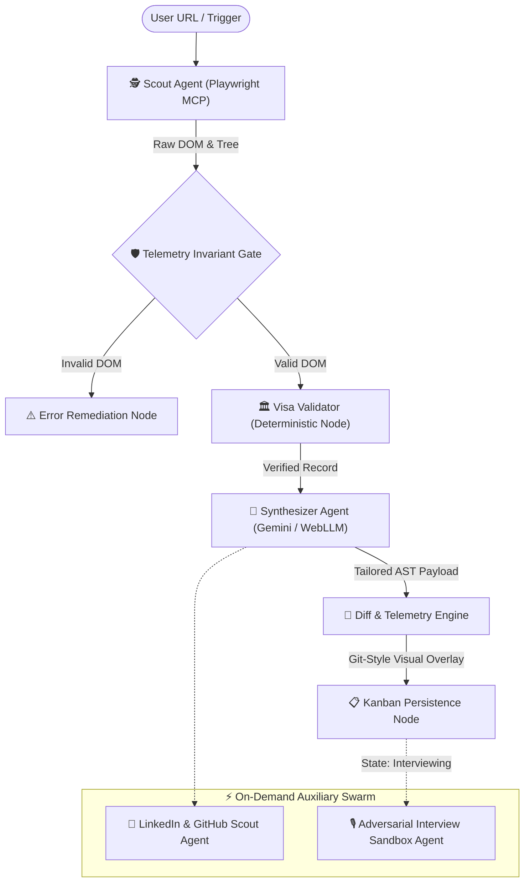

# 🤖 Agent Swarm & LangGraph Orchestration

## 1. Overview
**CHERENKOV-NEXUS** utilizes a multi-agent orchestration architecture modeled as a deterministic **Directed Acyclic Graph (DAG)** in TypeScript. Each specialized subagent handles an isolated phase of the career deployment pipeline, communicating through immutable state contracts.

---

## 2. LangGraph State Machine (DAG)



---

## 3. Core Graph State Type Definition

```typescript
export interface ApplicationState {
  // Input identifiers
  jobUrl: string;
  targetCompany: string;
  
  // Scraped telemetry
  rawDomContent: string;
  accessibilityTree: Record<string, any>;
  sanitizedRequirements: string[];
  
  // Compliance verification
  visaSponsorVerified: boolean;
  sponsorMetadata?: {
    licenseType: string;
    rating: string;
    minSalaryThresholdGbp: number;
    region: string;
  };
  
  // Synthesized AST payload
  tailoredAst: {
    tailoredSummary: string;
    matchScore: number;
    identifiedSkillGaps: string[];
    tailoredExperiences: Array<{
      role: string;
      company: string;
      achievements: string[];
    }>;
    atsAnswers: Array<{
      question: string;
      answer: string;
    }>;
    coldEmailPitch: string;
  };
  
  // Pipeline tracking
  executionMode: "cloud" | "local" | "hybrid";
  errors: string[];
  timestamp: string;
}
```

---

## 4. Specialized Swarm Node Catalog

### 4.1 The Scout Agent (Data Ingestion & Extraction)
- **Role:** Web interaction and DOM extraction.
- **Tools:** Playwright Stealth MCP, Cheerio fallback scraper.
- **Behavior:** Strips automated browser fingerprints (`navigator.webdriver`), parses the semantic accessibility tree, and extracts job requirements while rejecting non-job HTML garbage.

### 4.2 The Visa Compliance Validator (Deterministic Node)
- **Role:** Legal compliance and corporate entity verification.
- **Tools:** LibSQL client (`@libsql/client`), local SQLite cache (`nexus.db`).
- **Behavior:** Executes fuzzy name matching against the UK Home Office Register of Licensed Sponsors and EU Blue Card registers. Never hallucinates sponsorship.

### 4.3 The Synthesizer Agent (Profile Alignment & RAG)
- **Role:** Contextual AST synthesis.
- **Tools:** Google Gemini 2.5 Flash SDK (`@google/genai`), WebLLM browser worker, Ollama REST client.
- **Behavior:** Aligns candidate experiences with parsed job requirements using strict JSON Schema 2020-12 constraints.

### 4.4 The LinkedIn & Repo Scout Agent (Network Mapping)
- **Role:** Identifying hiring managers and analyzing technical commits.
- **Tools:** Cheerio DOM parser, GitHub REST API, Gemini personalized pitch generator.
- **Behavior:** Scans company domains for key engineering leads and recent open-source repositories to generate hyper-personalized cold outreach emails.

### 4.5 The Adversarial Interview Agent (Sandbox Simulation)
- **Role:** High-pressure technical interview evaluation.
- **Tools:** SpeechSynthesis / WebRTC audio channel, Gemini evaluation model.
- **Behavior:** Formulates challenging questions tailored to the company's tech stack and evaluates the candidate's live verbal/text response across depth, precision, and architecture.
