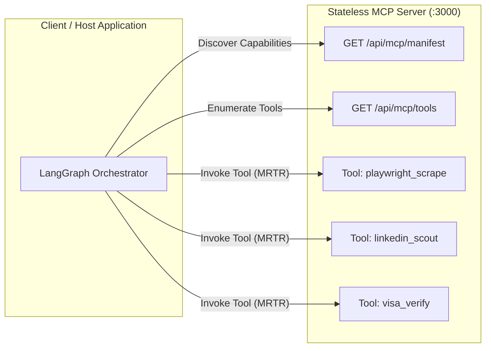
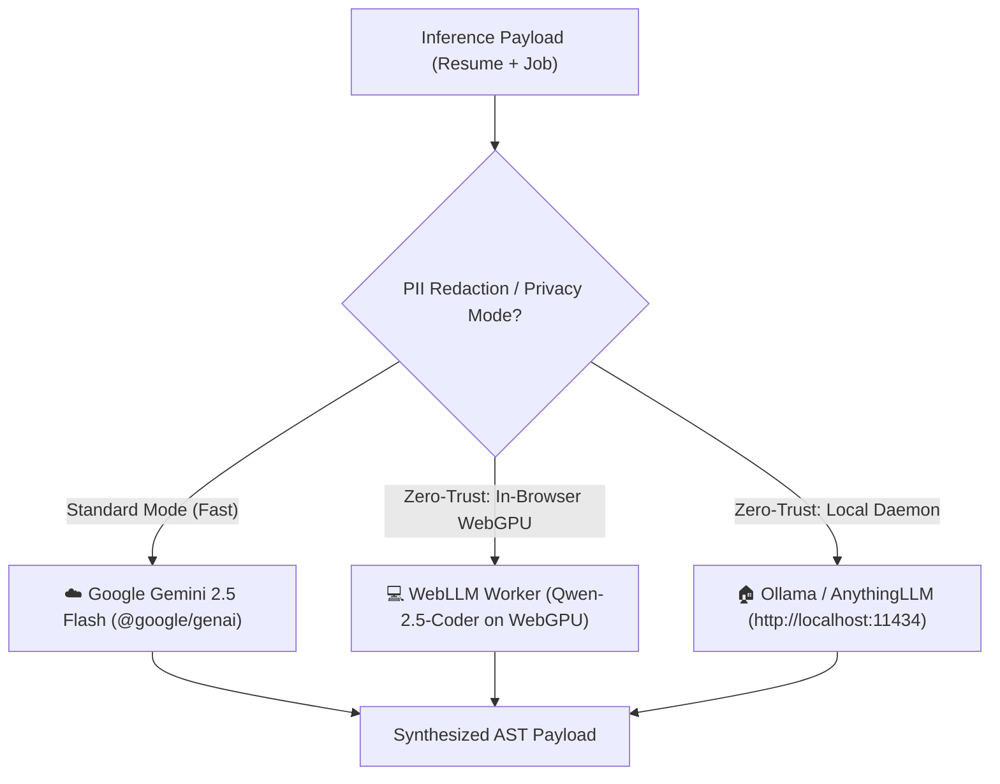

# 🧠 AI Engine & Model Context Protocol (MCP)

## 1. Compliance with the 2026-07-28 Stateless MCP Standard
**CHERENKOV-NEXUS** strictly complies with the official **Model Context Protocol (MCP) `2026-07-28` specification**. This standard eliminates fragile stateful sessions in favor of horizontally scalable, idempotent tool calls.



### Key MCP Architectural Invariants:
1. **Multi-Round-Trip Requests (MRTR):** Allows the LLM to request progressive browser actions (e.g. clicking pagination buttons or cookie banners) without maintaining expensive long-lived socket sessions.
2. **Universal Context (`_meta` object):** All tool invocations transmit metadata including authorization bounds, rate-limit budgets, and request tracing IDs.
3. **Stateless Tool Manifest:** Tools are declared dynamically with JSON-RPC compliant schemas.

---

## 2. Structured Output Enforcement (JSON Schema 2020-12)

To prevent runtime UI crashes in the React client, all generative outputs produced by `@google/genai` are strictly bound to JSON Schema 2020-12 via the SDK's `responseSchema` configuration.

```typescript
// Strict Response Schema in server.ts
const synthesisResponseSchema = {
  type: Type.OBJECT,
  properties: {
    tailored_summary: { 
      type: Type.STRING, 
      description: "Concise, ATS-tailored professional summary" 
    },
    match_score: { 
      type: Type.INTEGER, 
      description: "Calculated alignment percentage between 0 and 100" 
    },
    identified_skill_gaps: {
      type: Type.ARRAY,
      items: { type: Type.STRING },
      description: "List of missing or secondary required technical skills"
    },
    tailored_experiences: {
      type: Type.ARRAY,
      items: {
        type: Type.OBJECT,
        properties: {
          role: { type: Type.STRING },
          company: { type: Type.STRING },
          achievements: { 
            type: Type.ARRAY, 
            items: { type: Type.STRING } 
          }
        },
        required: ["role", "company", "achievements"]
      }
    },
    ats_answers: {
      type: Type.ARRAY,
      items: {
        type: Type.OBJECT,
        properties: {
          question: { type: Type.STRING },
          answer: { type: Type.STRING }
        },
        required: ["question", "answer"]
      }
    },
    cold_email: { 
      type: Type.STRING, 
      description: "Concise, punchy cold pitch tailored to the hiring manager" 
    }
  },
  required: ["tailored_summary", "match_score", "identified_skill_gaps", "ats_answers", "cold_email"]
};
```

---

## 3. Zero-Trust Local AI & WebGPU Inference



### In-Browser WebGPU Execution (`@mlc-ai/web-llm`)
- Operates entirely inside the client's browser using dedicated WebGPU compute shaders.
- Quantized models (e.g., `Qwen2.5-Coder-1.5B-Instruct-q4f16_1-MLC`) are cached in browser `IndexedDB`.
- Zero network packets containing candidate PII leave the host machine.
