# 🏛️ System Architecture Deep Dive

## 1. Executive Summary
**CHERENKOV-NEXUS** is engineered as a decoupled, local-first agentic operating system. The platform bifurcates responsibilities strictly between a high-frequency **Control Plane** (React 19 / Vite / Tauri v2) and a distributed **Execution Plane** (Node.js API Gateway, LangGraph State Machines, LibSQL Edge Database, and Stateless MCP Tooling).

---

## 2. Multi-Tiered Subsystem Architecture

```mermaid
graph TB
    subgraph Client_Tier ["🖥️ Control Plane (Presentation & UI State)"]
        UI["React 19 SPA (Vite)"]
        State["Zustand Global Store & LocalStorage"]
        AuraEngine["Theme Aura Engine & Canvas Effects"]
        CmdK["⌘ + K Global Command Palette"]
        TauriBridge["Tauri v2 IPC (Rust Backend Shell)"]
    end

    subgraph Gateway_Tier ["⚡ Gateway & Local Orchestration (Node.js / TSX)"]
        ExpressServer["Express.js Server (Port 3000)"]
        SSEHub["Server-Sent Events (SSE) Multiplexer"]
        LangGraphRuntime["LangGraph State Machine (TypeScript)"]
        AuthBoundary["Zero-Trust PII Redaction Boundary"]
    end

    subgraph Edge_DB_Tier ["💾 Data & Compliance Edge Tier"]
        LibSQLClient["@libsql/client (Turso Edge DB)"]
        LocalSQLite["Local SQLite Fallback (nexus.db)"]
        SponsorsCache["UK/EU Licensed Sponsors Registry"]
        MasterProfileAST["Master Profile AST (masterProfile.json)"]
    end

    subgraph MCP_Execution_Tier ["🤖 Stateless MCP & Automation Tier"]
        PlaywrightMCP["Playwright Stealth Scraper MCP"]
        LinkedInScoutMCP["LinkedIn & GitHub Analyzer MCP"]
        AudioInterviewMCP["Adversarial Audio Interview Sandbox"]
        xAPILRS["xAPI Webhook Listener (/api/webhooks/xapi)"]
    end

    subgraph Inference_Tier ["🧠 Multi-Model AI Routing Tier"]
        CloudEngine["Google Gemini 2.5 Flash SDK (@google/genai)"]
        LocalWebLLM["@mlc-ai/web-llm (Browser WebGPU)"]
        LocalOllamaAPI["Ollama / AnythingLLM REST Gateway"]
    end

    UI <-->|"HTTP REST / JSON-RPC / SSE"| ExpressServer
    UI <-->|"Native Syscalls"| TauriBridge
    ExpressServer <--> LangGraphRuntime
    LangGraphRuntime <--> LibSQLClient
    LibSQLClient <--> LocalSQLite
    LibSQLClient <--> SponsorsCache
    LangGraphRuntime <--> MasterProfileAST
    LangGraphRuntime --> PlaywrightMCP
    LangGraphRuntime --> LinkedInScoutMCP
    LangGraphRuntime --> AudioInterviewMCP
    ExpressServer --> xAPILRS
    LangGraphRuntime --> AuthBoundary
    AuthBoundary -->|"Cloud Route"| CloudEngine
    AuthBoundary -->|"WebGPU Route"| LocalWebLLM
    AuthBoundary -->|"Self-Hosted Route"| LocalOllamaAPI
```



---

## 3. Plane Separation & Data Flow

### 3.1 The Control Plane (React 19 + Zustand)
- **Role:** High-speed, 60fps presentation and user interaction layer.
- **Responsibilities:**
  - Visualizing the **Split-Screen Generative UI** (Reality Layer vs Synthesized AST Layer).
  - Rendering live `git diff` overlays highlighting resume modifications.
  - Providing instant clipboard ergonomics via `<CopyBlock>` components.
  - Managing the visual **Kanban Pipeline** with drag-and-drop column transitions.
  - Handling global keyboard hotkeys (`Cmd + K`, `Escape`, `Enter`).

### 3.2 The API Gateway & Orchestrator (Express.js)
- **Role:** Central coordination hub running locally on `http://localhost:3000`.
- **Responsibilities:**
  - Ingesting external webhooks (`/api/webhooks/xapi`) and multiplexing them via Server-Sent Events (SSE).
  - Executing LangGraph DAG workflows across scraping, visa checking, and synthesis.
  - Enforcing rate-limiting and exponential backoff against remote ATS portals.

### 3.3 The Data & Compliance Edge Tier (LibSQL / Turso)
- **Role:** Zero-latency deterministic verification of corporate legal entities.
- **Responsibilities:**
  - Querying UK Home Office and EU Blue Card sponsor registries in under 5ms.
  - Storing Kanban state snapshots and application telemetry.
  - Automatically failing over between Turso Cloud Edge and local SQLite (`nexus.db`).

### 3.4 The Execution Plane (Model Context Protocol)
- **Role:** Isolated external environment interactions adhering to the **MCP 2026-07-28** standard.
- **Responsibilities:**
  - Launching stealth Chromium instances with stripped `navigator.webdriver` flags.
  - Parsing deep accessibility trees instead of fragile CSS selectors.
  - Extracting ATS application forms and requirements without triggering Cloudflare challenges.

---

## 4. Subsystem Directory Topology

```text
cherenkov-nexus/
├── server/
│   └── mcp/
│       └── playwrightScraper.ts    # Headless Chromium accessibility tree harvester
├── src/
│   ├── components/                 # 23 Generative UI modules
│   │   ├── JobSynthesizer.tsx      # Split-Screen ATS tailoring & weaponry station
│   │   ├── KanbanBoard.tsx         # Multi-column application pipeline
│   │   ├── LearningSync.tsx        # Live xAPI competency matrix
│   │   ├── InterviewSandbox.tsx    # Audio-driven technical interview simulator
│   │   ├── LinkedInScoutModal.tsx  # Engineering team mapping modal
│   │   ├── IdentityVaultModal.tsx  # Zero-Trust PII & WebLLM WebGPU switcher
│   │   ├── CommandPalette.tsx      # Global Cmd+K keyboard navigator
│   │   └── ThemeAuraBackground.tsx # High-contrast visual engine
│   ├── data/                       # Default presets & mock identity
│   ├── hooks/                      # Custom React hooks (theme, hotkeys)
│   ├── utils/                      # AST converters & PDF export utilities
│   ├── App.tsx                     # Top-level state coordinator
│   └── types.ts                    # Strict TypeScript type contracts
├── server.ts                       # Express gateway & API route controllers
├── cherenkov.ts                    # Standalone terminal CLI runner
├── seed-database.ts                # LibSQL / SQLite sponsor database seeder
└── masterProfile.json              # Living candidate identity record
```

---

## 5. Security & Boundary Architecture
1. **Zero-Trust Local Boundary:** Candidate data can be routed entirely to on-device WebGPU models (`@mlc-ai/web-llm`) or local Ollama endpoints.
2. **Deterministic Visa Validation:** Sponsorship status is evaluated against government registers via SQL pattern matching (`LIKE %term%`), eliminating generative AI hallucination risk.
3. **Structured JSON Validation:** All cloud LLM payloads are validated against strict JSON Schema 2020-12 specifications before entering application state.
