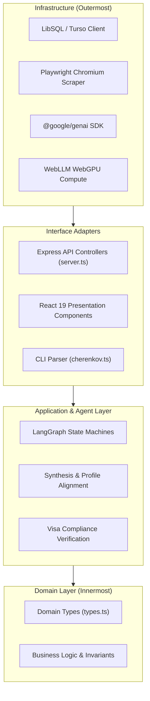

# 📐 Engineering Code Standards & Clean Architecture

## 1. Clean Architecture Principles

**CHERENKOV-NEXUS** adheres to the following foundational architecture principles:



1. **Separation of Concerns:** UI components must never perform direct database queries or raw web scraping. All interactions occur through API Gateway controllers or state hooks.
2. **Explicit Type Safety:** No implicit `any` types in production code. All payloads across network boundaries must have matching TypeScript interfaces.
3. **Immutability by Default:** State mutations in Zustand and LangGraph must return fresh object references.

---

## 2. TypeScript Strict Typing Conventions

```typescript
// ✅ RECOMMENDED: Explicit interface with discriminated unions
export type InferenceEngineMode = "cloud" | "local" | "hybrid";

export interface SponsorLookupResult {
  isLicensedSponsor: boolean;
  matchedSponsor: {
    name: string;
    aliases: string[];
    region: "UK" | "Germany" | "Netherlands" | "Ireland" | "EU";
    licenseType: string;
    rating: string;
    minSalaryThresholdGbp: number;
  } | null;
}

// ❌ DISALLOWED: Loose typing without constraints
export function checkSponsor(name: any): any {
  return name ? true : false;
}
```

---

## 3. Error Handling Contracts

All asynchronous API endpoints in `server.ts` must follow the standard envelope pattern:

```typescript
try {
  const result = await executeOperation();
  return res.status(200).json({
    success: true,
    data: result,
    timestamp: new Date().toISOString()
  });
} catch (error: any) {
  console.error(`[SYSTEM ERROR] Operation failed:`, error);
  return res.status(500).json({
    success: false,
    error: error.message || "Internal Server Error",
    code: "ERR_OPERATION_FAILED",
    timestamp: new Date().toISOString()
  });
}
```

---

## 4. Component Structure & React 19 Best Practices
- **Atomic Functional Components:** Keep UI blocks modular and focused on a single responsibility.
- **Hook Encapsulation:** Extract complex stateful logic into dedicated custom hooks (`hooks/`).
- **Defensive Rendering:** Always handle empty arrays, nullish strings, and loading skeletons to guarantee zero UI crashes during generative streaming.
