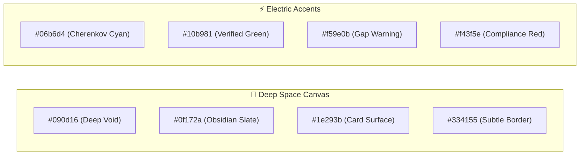
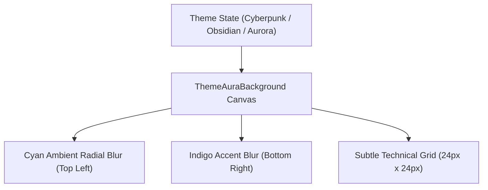

# 🎨 Visual Design System & UX Ergonomics

## 1. Design Philosophy
**CHERENKOV-NEXUS** employs a high-contrast, dark-mode-first aesthetic engineered for technical power users, Senior QA Architects, and Engineers. Inspired by next-generation IDEs (Zed, VSCodium, Warp), it prioritizes high information density, sub-second keyboard ergonomics, and visual telemetry over generic corporate fluff.

---

## 2. Color Palette & Theme Tokens

### Color Token Reference Table

| Token Name | Hex Code | Semantic Role |
|---|---|---|
| `--color-bg-void` | `#090d16` | Root application canvas and backdrop |
| `--color-surface-slate` | `#0f172a` | Primary card background, sidebar container |
| `--color-surface-elevated` | `#1e293b` | Modal bodies, dropdowns, elevated panels |
| `--color-accent-cyan` | `#06b6d4` | Active tabs, focus rings, primary action buttons |
| `--color-status-success` | `#10b981` | Licensed visa badge, 90%+ match score, copied tooltip |
| `--color-status-warning` | `#f59e0b` | Identified skill gap badge, unverified entity |
| `--color-status-error` | `#f43f5e` | Non-sponsor badge, Cloudflare scrape failure |

---

## 3. Visual Aura Background Engine (`ThemeAuraBackground.tsx`)

The system features dynamic background aura glows that pulse gently during AI synthesis and state transitions:

---

## 4. Key UI Ergonomic Components

### 4.1 Split-Screen Generative UI (N-Way Tiling)
- **Reality Layer (Left Column):** Renders the un-editable raw job requirements, employer constraints, salary range, and scraped ATS questions.
- **Generative Arsenal (Right Column):** Renders the AI-tailored AST summary, strategic bullet points, ATS questionnaire answers, and cold pitch email.

### 4.2 Real-Time Git Diff Engine
The tailored resume summary displays an interactive `git diff` overlay:
- **Red Strikethrough Text (`bg-rose-950/40 text-rose-300`):** Outdated or less relevant bullet points removed from the baseline profile.
- **Green Highlight Text (`bg-emerald-950/40 text-emerald-300`):** Newly synthesized keywords (e.g. `CodeQL`, `k6`, `Distributed Systems`) injected to match the job description.

### 4.3 Sub-Second Clipboard Ergonomics (`<CopyBlock>`)
Every ATS answer and synthesized bullet point is wrapped in a `<CopyBlock>` component:
- Single-click copies plain text to the OS clipboard.
- Instantly flashes an animated emerald `"Copied!"` badge with checkmark icon.
- Enables rapid pasting into Greenhouse, Lever, and Workday portals in seconds.

### 4.4 Global Keyboard Command Palette (`Cmd + K`)
- Listens globally for `Cmd + K` (macOS) or `Ctrl + K` (Windows/Linux).
- Supports instant fuzzy searching across all system hubs:
  - `> New Application [URL]`
  - `> Open Identity Vault`
  - `> Sync Coursera Webhook`
  - `> Launch Voice Interview Sandbox`
  - `> Switch Theme Aura`
