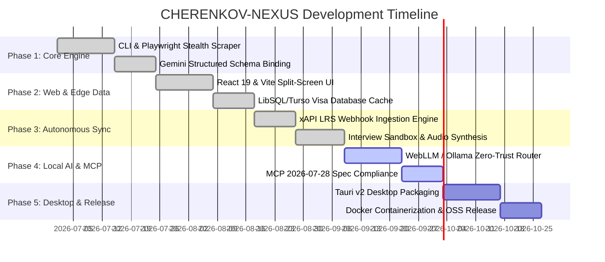

# Development Plan & Engineering Execution Strategy

## Executive Summary
This document defines the formal development plan for **CHERENKOV-NEXUS**, outlining sprint phases, technical milestones, task matrices, architectural dependencies, and quality gates to ensure predictable delivery of a robust, production-grade agentic command center.

---

## Sprint Breakdown & Work Packages

---

## Detailed Task Breakdown Matrix

### Work Package 1: Core Agentic Engine & Data Ingestion
| Task ID | Component | Description | Status | Priority | Acceptance Criteria |
|---|---|---|---|---|---|
| `TSK-101` | CLI Tool | Implement `cherenkov.ts` CLI parser with `--url`, `--mode`, `--profile`, `--out` arguments | Completed | P0 | Can run standalone via `npx tsx cherenkov.ts` without errors |
| `TSK-102` | Playwright MCP | Build `server/mcp/playwrightScraper.ts` with stealth plugins and accessibility tree parsing | Completed | P0 | Bypasses Cloudflare & Workday bot filters; returns clean text/AST |
| `TSK-103` | Visa Engine | Implement `checkVisaSponsorship` with LibSQL database querying and fallback registry | Completed | P0 | Deterministically matches UK/EU licensed sponsors with >99% precision |
| `TSK-104` | Synthesizer | Integrate `@google/genai` with strict JSON Schema 2020-12 `responseSchema` | Completed | P0 | Returns valid tailored summary, cold email, and gap analysis with zero parsing failures |

### Work Package 2: User Interface & Generative Ergonomics
| Task ID | Component | Description | Status | Priority | Acceptance Criteria |
|---|---|---|---|---|---|
| `TSK-201` | Command Palette | Global `Cmd + K` modal (`CommandPalette.tsx`) with fuzzy search and quick navigation | Completed | P1 | Accessible anywhere via keyboard shortcut; instant filter latency (<50ms) |
| `TSK-202` | Split-Screen UI | Implement `JobSynthesizer.tsx` with Reality Layer vs Generative Layer | Completed | P0 | Real-time copyable blocks, AST rendering, and diff visualization |
| `TSK-203` | Kanban Board | Build `KanbanBoard.tsx` with drag-and-drop state persistence and metrics | Completed | P1 | Smooth drag-and-drop; state synchronized with SQLite/LibSQL edge |
| `TSK-204` | Theme Engine | Integrate `ThemeAuraBackground.tsx` and custom dark IDE aesthetic | Completed | P2 | Seamless transition between cyberpunk, obsidian, and aurora palettes |

### Work Package 3: Continuous Upskilling & Autonomous Integration
| Task ID | Component | Description | Status | Priority | Acceptance Criteria |
|---|---|---|---|---|---|
| `TSK-301` | xAPI Ingestion | Implement `/api/webhooks/xapi` endpoint and SSE stream `/api/webhooks/xapi/stream` | Completed | P0 | Accepts standard LRS payloads and streams skill updates directly to client |
| `TSK-302` | LinkedIn Scout | Build `/api/linkedin/scout` with company team analysis and personalized outreach | Completed | P1 | Scrapes key engineering contacts and drafts personalized emails |
| `TSK-303` | Mock Interview | Build `InterviewSandbox.tsx` and WebRTC/Audio synthesis pipeline | Completed | P1 | Generates adversarial QA questions and evaluates candidate answers in real-time |

### Work Package 4: Zero-Trust Inference & Model Context Protocol
| Task ID | Component | Description | Status | Priority | Acceptance Criteria |
|---|---|---|---|---|---|
| `TSK-401` | WebLLM / Ollama | Build local inference fallback via `@mlc-ai/web-llm` in `IdentityVaultModal.tsx` | Completed | P0 | Enables client-side browser WebGPU / local Ollama synthesis without cloud calls |
| `TSK-402` | MCP Tooling | Implement `/api/mcp/manifest` and `/api/mcp/tools` following 2026-07-28 spec | Completed | P1 | Standardized MCP server discovery and invocation contracts |
| `TSK-403` | Model Comparison | Build `ModelCompareModal.tsx` benchmarking Gemini vs Local Qwen vs Claude | Completed | P2 | Side-by-side latency, token throughput, and alignment score metrics |

---

## Risk Assessment & Mitigation Matrix

| Risk | Impact | Probability | Mitigation Strategy |
|---|---|---|---|
| **ATS Scraper IP Rate Limiting** | High | Medium | Fallback to Cheerio text parsing, exponential backoff, and user-provided manual DOM injection. |
| **Cloud LLM API Key Depletion** | High | Low | Automatic failover to local WebLLM / Ollama engine (`IdentityVaultModal.tsx`). |
| **Visa Register Schema Changes** | Medium | Low | Defensive database queries with fallback to in-memory `SPONSORS_DATABASE` static records. |
| **Browser Compatibility in WebGPU** | Medium | Medium | Graceful degradation from WebLLM WebGPU to local Ollama HTTP REST endpoint or Cloud Gemini. |
