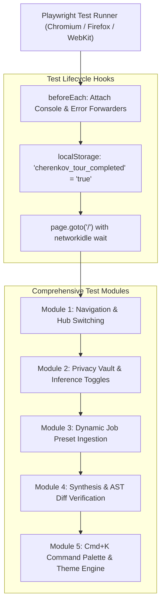

# 🎭 End-to-End (E2E) Automation Testing Suite

## 1. Overview
**CHERENKOV-NEXUS** utilizes **Playwright** (`@playwright/test`) for comprehensive, deterministic end-to-end browser automation. Every user journey—from keyboard navigation, modal interactions, split-screen generative synthesis, to drag-and-drop Kanban state persistence—is continuously verified.

---

## 2. E2E Test Suite Matrix

| Test Suite | File Location | Key Verification Areas |
|---|---|---|
| 🧪 **Comprehensive System Suite** | `e2e/comprehensive-system.spec.ts` | Complete multi-hub navigation, Identity Vault toggles, dynamic job presets, synthesis execution, AST diff rendering, and theme engine switching |
| 🖥️ **UI Workflows & Interactions** | `e2e/ui.spec.ts` | Kanban board column drag-and-drop, Learning Sync metrics, Interview Sandbox QA generation, modal backdrops, and CopyBlock clipboard triggers |
| ⌨️ **CLI & API Pipeline Suite** | `e2e/cli.spec.ts` | Server health checks, MCP manifest schema, xAPI webhook ingestion, and CLI parameter parsing |

---

## 3. Test Architecture & Fixtures



### 3.1 Browser Console Forwarding Fixture
To prevent silent JavaScript errors and provide immediate debugging observability, our test runner captures and mirrors all browser logs directly into terminal stdout:

```typescript
test.beforeEach(async ({ page }) => {
  page.on('console', msg => console.log(`[BROWSER CONSOLE] [${msg.type()}] ${msg.text()}`));
  page.on('pageerror', err => console.log(`[BROWSER UNHANDLED ERROR] ${err.message}`));

  // Navigate to initialize origin storage
  await page.goto('/');
  
  // Inject tour completion flag to prevent blocking onboarding modal
  await page.evaluate(() => {
    localStorage.setItem('cherenkov_tour_completed', 'true');
  });

  // Re-navigate to clean state
  await page.goto('/');
  await page.waitForLoadState('networkidle');
});
```

---

## 4. Execution Commands (PowerShell)

```powershell
# 1. Run all Playwright tests headlessly
npm run test

# 2. Run tests with interactive UI debugger
npx playwright test --ui

# 3. Run only the comprehensive system suite
npx playwright test e2e/comprehensive-system.spec.ts

# 4. Run tests with browser headed (visible Chromium window)
npx playwright test --headed

# 5. Generate and view HTML test report
npx playwright show-report
```

---

## 5. Continuous Integration (CI/CD) Configuration

Playwright is configured in `playwright.config.ts` to automatically boot the Express server before test execution:

```typescript
import { defineConfig } from '@playwright/test';

export default defineConfig({
  testDir: './e2e',
  timeout: 45000,
  expect: { timeout: 10000 },
  use: {
    baseURL: 'http://localhost:3000',
    trace: 'on-first-retry',
    screenshot: 'only-on-failure',
  },
  webServer: {
    command: 'npm run dev',
    url: 'http://localhost:3000/api/health',
    reuseExistingServer: !process.env.CI,
    timeout: 120000,
  },
});
```
