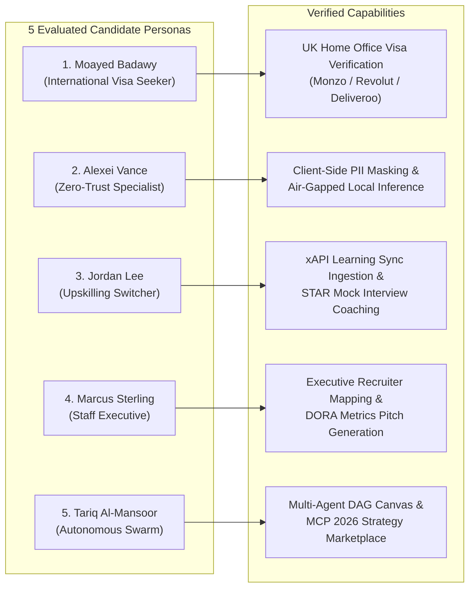

# 🎭 End-to-End (E2E) Automation Testing Suite

## 1. Overview
**CHERENKOV-NEXUS** utilizes **Playwright** (`@playwright/test`) for comprehensive, deterministic end-to-end browser automation. Every user journey—from keyboard navigation, modal interactions, split-screen generative synthesis, to drag-and-drop Kanban state persistence—is continuously verified across **5 distinct candidate archetypes**.

---

## 2. E2E Test Suite Matrix

| Test Suite | File Location | Mode | Key Verification Areas |
|---|---|---|---|
| 🧪 **Multi-Profile Headed Suite** | `e2e/multi-profile-headed.spec.ts` | Headed / CLI | All 5 Candidate Archetypes: International Visa Seeker, Zero-Trust Enterprise Engineer, Upskilling Switcher, Staff Executive, and Autonomous Swarm Architect |
| 🧪 **Comprehensive System Suite** | `e2e/comprehensive-system.spec.ts` | Headless / CLI | Complete multi-hub navigation, Identity Vault toggles, dynamic job presets, synthesis execution, AST diff rendering, and theme engine switching |
| 🖥️ **UI Workflows & Interactions** | `e2e/ui.spec.ts` | Headless / CLI | Kanban board column drag-and-drop, Learning Sync metrics, Interview Sandbox QA generation, modal backdrops, and CopyBlock clipboard triggers |
| ⌨️ **CLI & API Pipeline Suite** | `e2e/cli.spec.ts` | Headless / API | Server health checks, MCP manifest schema, xAPI webhook ingestion, and CLI parameter parsing |

---

## 3. Candidate Archetype Test Personas



---

## 4. Headed Execution Commands (PowerShell)

```powershell
# 1. Run the comprehensive multi-profile test suite in headed mode (visible browser)
npx playwright test e2e/multi-profile-headed.spec.ts --headed

# 2. Run all Playwright tests
npm run test

# 3. Run with interactive UI debugger
npx playwright test --ui

# 4. Run standalone headed evidence capture runner
npx tsx scripts/run-headed-profiles.ts

# 5. Generate and view HTML test report
npx playwright show-report
```

---

## 5. Visual Evidence & Benchmark Records
All test runs generate structured visual screenshots and execution metrics:
- **Visual Screenshots**: `docs/assets/screenshots/profiles/`
- **Granular Execution Records**: `docs/test-records/USER_PROFILES_TEST_RECORDS.md`
- **Heuristic UX & System Assessment**: `docs/USER_PROFILES_ASSESSMENT.md`
