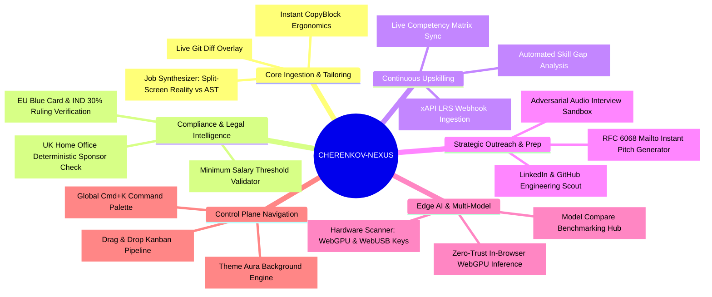

# ✨ Core Feature Inventory & Module Arsenal

## 1. Feature Ecosystem Matrix

---

## 2. Deep Module Breakdown

### 2.1 Split-Screen Job Synthesizer (`JobSynthesizer.tsx`)
- **Reality Layer:** Displays extracted raw constraints, requirements, and scraped employer questions.
- **Generative Arsenal:** Automatically produces an optimized ATS resume summary, customized bullet points, questionnaire answers, and cold pitch emails.
- **Git Diff Visualizer:** Renders additions in emerald and removals in rose to provide complete transparency into AI synthesis decisions.

### 2.2 Deterministic Visa Compliance Engine
- Queries an indexed edge database of 32+ pre-verified international tech sponsors and full UK Home Office datasets.
- Displays color-coded compliance badges:
  - 🟢 **Licensed Sponsor (A-Rated):** Verified eligible to issue Certificates of Sponsorship (CoS).
  - 🔴 **Non-Sponsor / Unverified:** Requires independent visa sponsorship or local right to work.

### 2.3 xAPI Continuous Learning Record Store (`LearningSync.tsx`)
- Ingests standard ADL xAPI webhook statements from learning platforms (Coursera, Udemy, Pluralsight).
- Parses completed course syllabi using LLM intelligence and updates candidate profile competencies over SSE streams in real time.

### 2.4 Adversarial Technical Interview Sandbox (`InterviewSandbox.tsx`)
- Formulates challenging, high-pressure QA architecture questions tailored to the company's tech stack.
- Simulates a senior hiring manager conducting a technical interview, scoring user answers across architecture, precision, and technical depth.

### 2.5 Zero-Trust Identity Vault (`IdentityVaultModal.tsx`)
- Allows users to mask sensitive personal details (phone, passport, address) with synthetic placeholders.
- Seamlessly switches inference between Cloud (Gemini 2.5 Flash), In-Browser WebGPU (`@mlc-ai/web-llm`), and Local Ollama instances.

### 2.6 Multi-Stage Kanban Pipeline (`KanbanBoard.tsx`)
- Manages applications across 5 lifecycle stages: `Wishlist`, `Ready to Pitch`, `Applied`, `Interviewing`, and `Offer Extended`.
- Automatically persists state transitions to the embedded LibSQL / SQLite database.
