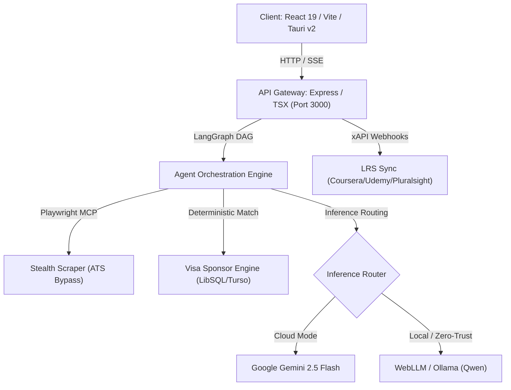

# Engineering Handover Protocol

## Overview & Operational Status
**Project:** CHERENKOV-NEXUS  
**Repository:** `moaidmoatasem/cherenkov-nexus`  
**Current Branch:** `main`  
**Runtime Environment:** Node.js v20+ (TSX / Express API Gateway), React 19 + Vite Frontend, Tauri v2 Desktop Shell, LibSQL / Turso Edge Database, Playwright Stealth MCP Scraper, Google Gemini 2.5 Flash SDK + WebLLM / Ollama Local Inference Router.

---

## Live System Architecture Snapshot



---

## Critical System Invariants & Rules
1. **PowerShell Syntax Enforced:** Never use `&&` in terminal commands. Always use `;` for chaining commands on Windows PowerShell.
2. **Deterministic Verification:** Visa sponsorship must always query the LibSQL / Turso sponsor cache (or local fallback), never allowing AI hallucination of visa status.
3. **Structured JSON Output:** LLM synthesis responses are strictly enforced using JSON Schema 2020-12 via `@google/genai` `responseSchema`.
4. **Token Limit Handover:** If context size nears exhaustion, this document (`docs/HANDOVER.md`) and `docs/DEVELOPMENT_PLAN.md` must be updated with the exact commit hash, current state, and immediate next commands before yielding execution.
5. **Proof of Work Required:** All completed tasks must be verified with automated test suites, staged, committed, and pushed to `origin main` before declaring them done.

---

## Environment & Dependency Matrix

| Variable / Dependency | Purpose | Status / Default |
|---|---|---|
| `GEMINI_API_KEY` | Google Gemini API inference for Synthesizer & LinkedIn Scout | Required for Cloud Inference |
| `TURSO_DATABASE_URL` | Edge LibSQL database endpoint for Visa Registry & Kanban sync | Optional (Falls back to local SQLite) |
| `TURSO_AUTH_TOKEN` | Auth token for Turso Edge DB | Optional |
| `LOCAL_LLM_URL` | Endpoint for Ollama / Local Qwen instance | Default: `http://localhost:11434/v1` |
| `PORT` | API Gateway & Vite dev middleware port | Default: `3000` |

---

## Quick Execution Commands (PowerShell)

### 1. Start Server & Client
```powershell
npm run dev
```

### 2. Seed Database (LibSQL / SQLite)
```powershell
npx tsx seed-database.ts
```

### 3. Run CLI Mode
```powershell
npx tsx cherenkov.ts --url "https://careers.google.com/jobs/results/12345" --mode cloud
```

### 4. Run E2E Test Suite
```powershell
npm run test
# Or run specific suite
npx playwright test e2e/comprehensive-system.spec.ts
```

---

## Ongoing Tasks & Immediate Next Steps for Subsequent Agents

- [x] Establish core API Gateway (`server.ts`) and CLI tool (`cherenkov.ts`).
- [x] Implement LibSQL/Turso database client and local SQLite seeding script (`seed-database.ts`).
- [x] Build comprehensive E2E Playwright test suites (`e2e/comprehensive-system.spec.ts`, `e2e/cli.spec.ts`, `e2e/ui.spec.ts`).
- [ ] Maintain 100% sync between the live codebase and the documentation suite (`docs/`).
- [ ] Extend Mock/Offline test coverage for WebLLM browser worker threads in `src/components/IdentityVaultModal.tsx`.
- [ ] Finalize Docker Compose deployment bundle for zero-configuration team deployment.
