# 🔌 System Integrations & External Protocols

## 1. Integration Architecture Overview

**CHERENKOV-NEXUS** interfaces with multiple external government datasets, learning record platforms, browser automation environments, and local hardware APIs.

```mermaid
graph TD
    NexusCore["CHERENKOV-NEXUS Core Engine"]
    
    subgraph Government_Compliance ["🏛️ Government Data Integrations"]
        HomeOffice["UK Home Office Register of Licensed Sponsors"]
        IndNL["Netherlands IND Public Register (30% Ruling)"]
        BlueCardDE["German Federal BAMF / Blue Card Register"]
    end
    
    subgraph Learning_Standards ["🎓 Continuous Upskilling & Standards"]
        xAPI["xAPI (Experience API / ADL LRS Spec)"]
        Coursera["Coursera / Udemy Webhook Publishers"]
    end
    
    subgraph Browser_Protocols ["🌐 Scraping & System Protocols"]
        PlaywrightStealth["Playwright + Stealth Anti-Bot Bypass"]
        MailtoProtocol["RFC 6068 Mailto URI Protocol"]
        GitHubAPI["GitHub REST & GraphQL API"]
    end
    
    subgraph Hardware_Edge ["⚡ Local Hardware & Edge Storage"]
        WebGPU["W3C WebGPU API (In-Browser Inference)"]
        WebUSB["W3C WebUSB API (Hardware Security Keys)"]
        TursoEdge["LibSQL / Turso Distributed Edge DB"]
    end
    
    NexusCore <--> HomeOffice
    NexusCore <--> IndNL
    NexusCore <--> BlueCardDE
    NexusCore <--> xAPI
    Coursera --> xAPI
    NexusCore --> PlaywrightStealth
    NexusCore --> MailtoProtocol
    NexusCore <--> GitHubAPI
    NexusCore <--> WebGPU
    NexusCore <--> WebUSB
    NexusCore <--> TursoEdge
```



---

## 2. Deep Dive: External Integrations

### 2.1 UK Home Office & EU Visa Sponsorship Registry
- **Objective:** Eliminate generative hallucination by providing deterministic proof of visa sponsorship license status.
- **Data Ingestion Pipeline:**
  - Queries local LibSQL / SQLite database (`nexus.db`) containing indexed sponsor records with alias mapping, minimum salary thresholds (£41,700 for UK Skilled Worker), and rating classifications (`A Rating`, `IND Recognized`, `Verified Sponsor`).
  - Implements fuzzy SQL search (`LIKE %query%`) over organization names and brand aliases (e.g. "AWS" -> "Amazon UK Services Ltd").

### 2.2 Learning Platform Synchronization (xAPI / ADL LRS)
- **Objective:** Transform the candidate profile into a continuously evolving living document.
- **Endpoint:** `POST /api/webhooks/xapi` & `GET /api/webhooks/xapi/stream` (SSE).
- **Payload Contract:**
  ```json
  {
    "actor": {
      "mbox": "mailto:candidate@cherenkov.nexus",
      "name": "Senior Candidate"
    },
    "verb": {
      "id": "http://adlnet.gov/expapi/verbs/completed",
      "display": { "en-US": "completed" }
    },
    "object": {
      "id": "http://coursera.org/courses/advanced-codeql-security",
      "definition": {
        "name": { "en-US": "Advanced CodeQL Static Analysis & Security Testing" }
      }
    }
  }
  ```
- **Automated Skill Ingestion:** The Express server parses the syllabus via `@google/genai`, extracts specific framework competencies (e.g. `CodeQL`, `k6`, `Playwright`), and broadcasts the new skills over SSE to update the React client in real time.

### 2.3 Playwright Stealth Scraper (MCP Worker)
- **Objective:** Extract clean accessibility trees from heavily fortified SPAs (Workday, Greenhouse, Lever, Taleo) without triggering Cloudflare challenges.
- **Configuration:** Launches Chromium with `--disable-blink-features=AutomationControlled` and overrides `navigator.webdriver`.
- **Parsing Strategy:** Uses `@playwright/test` / `playwright-core` to inspect the DOM hierarchy and accessibility trees, stripping away styling fluff and returning structured role requirements.

### 2.4 RFC 6068 Mailto URI Protocol
- **Objective:** Zero-dependency cold email deployment.
- **Mechanism:** Encodes generated technical pitch text, subject lines, and hiring manager email addresses into a standard `mailto:` URI, immediately activating the user's native email client (Outlook, Thunderbird, Apple Mail) without requiring SMTP credentials or third-party OAuth access.

### 2.5 GitHub Repository Analysis
- **Objective:** Deep technical alignment with open-source company repositories.
- **Endpoint:** `POST /api/github/analyze-repo`.
- **Functionality:** Scans public repository architectures, commit histories, and pull requests to inject authentic context into cover letters and interview talking points.

### 2.6 W3C WebGPU & WebUSB Hardware Scanner
- **Objective:** Local-first zero-trust hardware acceleration and authentication.
- **Endpoint:** `POST /api/onboarding/hardware-scan`.
- **Functionality:** Discovers available GPU compute adapters for in-browser WebLLM model execution and queries connected hardware security keys.
