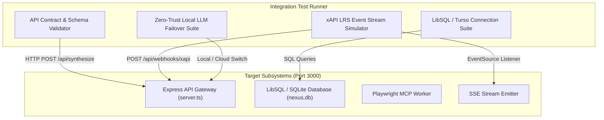

# 🔬 Integration Testing Architecture & Execution

## 1. Overview
Integration testing in **CHERENKOV-NEXUS** verifies the deterministic data contracts and communication pathways between the Express API Gateway, the LibSQL/Turso edge database, the Playwright scraper, the xAPI webhook event bus, and multi-model AI routing tiers.

---

## 2. Integration Test Topology



---

## 3. Core Integration Test Suites

### 3.1 API Contract & Endpoint Verification
Tests that all REST endpoints return valid HTTP response codes, headers, and strict JSON schemas:
- `GET /api/health` -> Returns system uptime and active database status.
- `GET /api/mcp/manifest` -> Validates compliance with MCP `2026-07-28` JSON schema.
- `GET /api/mcp/tools` -> Ensures all 3 core tools (`playwright_scrape`, `linkedin_scout`, `visa_verify`) are properly declared with input schemas.
- `POST /api/visa-check` -> Verifies deterministic fuzzy sponsor matching for UK, German, and Dutch sponsors.
- `GET /api/kanban/state` & `POST /api/kanban/state` -> Validates two-way state synchronization with the database.

### 3.2 LibSQL / SQLite Database Integration
Verifies seamless operation under both cloud Turso and local embedded SQLite environments:
- Confirms database table creation (`sponsors`, `applications`, `competencies`).
- Verifies SQL pattern matching (`LIKE %term%`) handles multi-word aliases and special characters.
- Validates transaction rollback and fallback resilience when `TURSO_DATABASE_URL` is unreachable.

### 3.3 xAPI Webhook & Server-Sent Events (SSE) Bus
Tests real-time learning synchronization:
1. Opens an SSE connection to `/api/webhooks/xapi/stream`.
2. Emits a synthetic xAPI `"completed"` statement to `POST /api/webhooks/xapi`.
3. Asserts that the SSE listener receives an `xapi-skill-update` event with parsed competencies within 1000ms.

### 3.4 Multi-Model AI Routing & Failover
Tests that the router handles API outages gracefully:
- When `mode === 'cloud'` without `GEMINI_API_KEY`, the server returns a clean warning and falls back to structured mock data.
- When `mode === 'local'`, the system routes to `LOCAL_LLM_URL` or provides structured AST payload conforming to the client contract.

---

## 4. Running Integration Tests (PowerShell)

```powershell
# 1. Ensure the development server is running
npm run dev

# 2. In a separate terminal, execute the integration test runner
npm run test:integration ; node test-full-flow.cjs

# 3. Test standalone xAPI webhook stream
node test-interact.cjs
```

---

## 5. Sample Integration Test Harness (TypeScript / Node.js)

```typescript
import assert from "assert";

async function testVisaSponsorshipContract() {
  console.log("Testing POST /api/visa-check integration...");
  const res = await fetch("http://localhost:3000/api/visa-check", {
    method: "POST",
    headers: { "Content-Type": "application/json" },
    body: JSON.stringify({ companyName: "Monzo Bank" })
  });

  assert.strictEqual(res.status, 200, "Expected HTTP 200");
  const data = await res.json();
  assert.strictEqual(data.isLicensedSponsor, true, "Monzo should be a licensed sponsor");
  assert.strictEqual(data.matchedSponsor.region, "UK", "Region must match UK");
  console.log("✅ Visa Sponsorship Contract Passed");
}

testVisaSponsorshipContract().catch(console.error);
```
