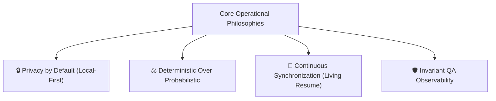

# 🧭 Northstar, Vision & Strategic Principles

## 1. Core Vision Statement
To engineer a localized, agentic command center that transforms the international tech career pipeline from an exhaustive, manual submission process into a proactive, deterministically verifiable deployment pipeline.

**CHERENKOV-NEXUS** empowers Senior QA Engineers, Infrastructure Architects, and Technical Leaders to target high-compensation, visa-sponsored roles across the UK, EU, and Global Remote markets without cognitive fatigue or computational waste.

---

## 2. Operational Philosophies

1. **Privacy by Default (Zero-Trust):** Candidate PII (passports, residential addresses, contact details) must never be transmitted unencrypted to cloud AI services. The platform enables 100% on-device WebGPU inference via `@mlc-ai/web-llm` and local Ollama routing.
2. **Deterministic Over Probabilistic:** Visa sponsorship eligibility is never hallucinated or guessed by an AI model. It is deterministically validated against official government registers (UK Home Office, IND, BAMF) using LibSQL/Turso database querying.
3. **Continuous Living Profile:** A career record is not a static PDF file; it is an active Abstract Syntax Tree (AST). It continuously ingests verified competencies via xAPI webhooks as courses and certifications are completed.
4. **Invariant QA Observability:** Treating job application workflows like automated QA pipelines. Defensive invariant checks catch failing scrapers and malformed schemas before they reach the user.

---

## 3. Measurable Success Metrics (KPIs)

| Metric | Target Goal | Impact on Career Velocity |
|---|---|---|
| **Application Synthesis Time** | < 10 seconds | Reduces resume tailoring & cover letter drafting time by 90%+ |
| **Deterministic Visa Accuracy** | 100% | Eliminates wasted effort on non-sponsoring corporate entities |
| **Generative First Token Latency (TTFT)** | < 800ms | Delivers instant, responsive split-screen UI rendering |
| **Local Zero-Trust Adoption** | 100% Offline Capability | Guarantees complete data privacy on bare-metal hardware |

---

## 4. Architectural Anti-Goals
* **No Blind Spam Bots:** We do NOT build tools that spam hundreds of job boards with unreviewed submissions. We empower thoughtful, human-in-the-loop technical alignment.
* **No Cloud Vendor Lock-In:** The AI routing plane conforms to the open Model Context Protocol (MCP), enabling instant swapping between cloud APIs and local GGUF models.
* **No Unverified Data Assumptions:** If an employer's sponsorship rating cannot be verified, it is clearly flagged as unverified rather than assumed.
