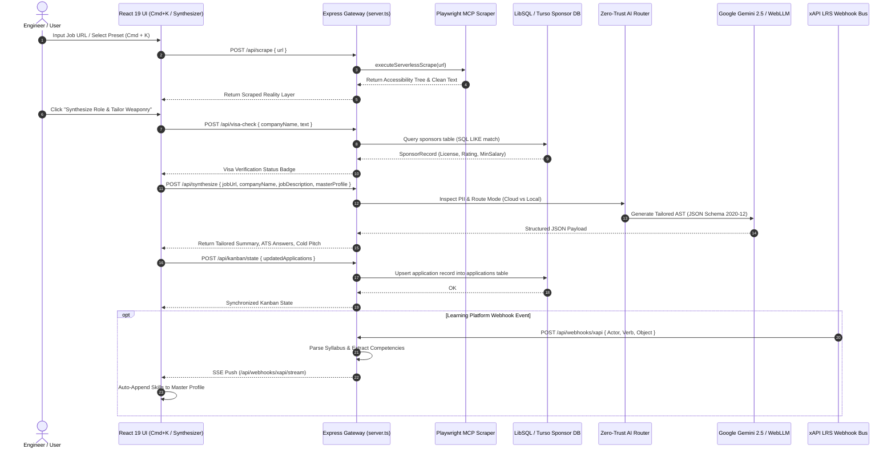
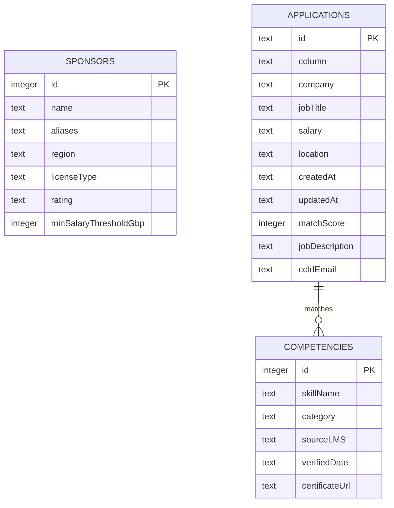
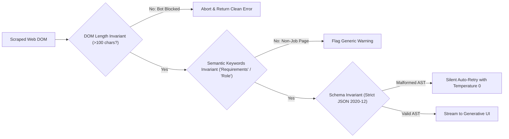
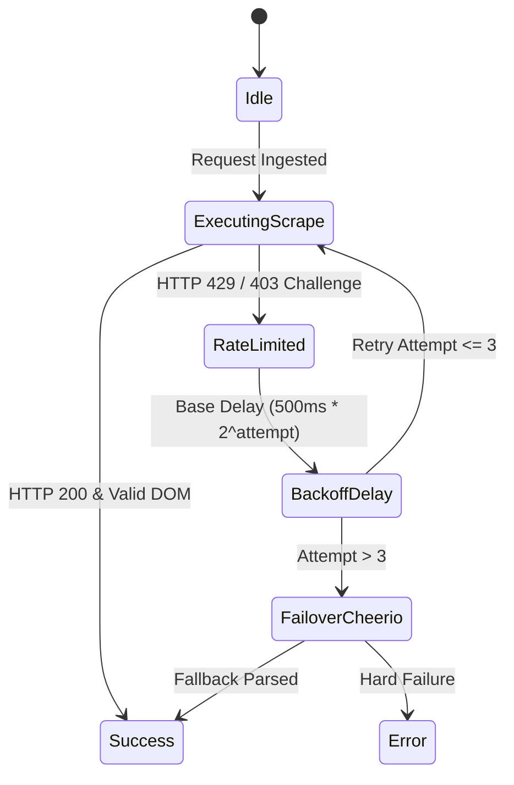

# ⚡ System Design & Data Pipeline Specification

## 1. End-to-End Execution Sequence

The primary user journey begins with job ingestion via the UI or CLI and culminates in synthesized AST assets, visa validation, and live Kanban pipeline tracking.



---

## 2. Database Schema & Data Models (LibSQL / SQLite)

The platform utilizes LibSQL / SQLite (`nexus.db`) for deterministic querying and edge persistence.



### Table Definitions (DDL)

```sql
-- UK & EU Licensed Visa Sponsors
CREATE TABLE IF NOT EXISTS sponsors (
  id INTEGER PRIMARY KEY AUTOINCREMENT,
  name TEXT NOT NULL,
  aliases TEXT NOT NULL,
  region TEXT NOT NULL,
  licenseType TEXT NOT NULL,
  rating TEXT NOT NULL,
  minSalaryThresholdGbp INTEGER NOT NULL
);

-- Kanban Application Pipeline State
CREATE TABLE IF NOT EXISTS applications (
  id TEXT PRIMARY KEY,
  column TEXT NOT NULL,
  company TEXT NOT NULL,
  jobTitle TEXT NOT NULL,
  salary TEXT,
  location TEXT,
  createdAt TEXT NOT NULL,
  updatedAt TEXT NOT NULL,
  matchScore INTEGER DEFAULT 0,
  jobDescription TEXT,
  coldEmail TEXT
);

-- Learning Record Store (xAPI Ingestion)
CREATE TABLE IF NOT EXISTS competencies (
  id INTEGER PRIMARY KEY AUTOINCREMENT,
  skillName TEXT NOT NULL,
  category TEXT NOT NULL,
  sourceLMS TEXT NOT NULL,
  verifiedDate TEXT NOT NULL,
  certificateUrl TEXT
);
```

---

## 3. Invariant Testing & Observability Methodology

Derived from the `cherenkov-qa` discipline, all system nodes execute automated invariants:



### Invariant Catalog
1. **Scrape Invariant:** If `rawDomContent.length < 100` or Cloudflare challenge markers are detected, the scraper automatically attempts an accessibility tree fallback or returns an actionable error.
2. **Deterministic Visa Invariant:** If the target company name does not exist in the database, the system will never guess sponsorship; it flags the role as `Unverified / Independent Sponsoring Required`.
3. **Structured Output Invariant:** All generative outputs are validated against the schema. If any field is missing or contains incorrect primitive types, the response is rejected before updating client state.

---

## 4. Rate Limiting, Exponential Backoff & Fault Tolerance



- **Per-Domain Rate Limiting:** Enforces maximum 5 requests/minute against major ATS portals (`workday.com`, `greenhouse.io`, `lever.co`).
- **Jittered Backoff:** Retries failed network requests with randomized exponential backoff (`delay = (2^attempt * 500ms) + random(0, 200ms)`).
- **Turso Edge Failover:** If connection to Turso Cloud Edge times out (>1500ms), the API Gateway immediately falls back to the local embedded SQLite database (`nexus.db`).
