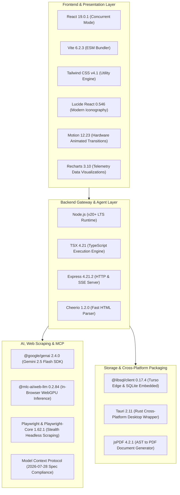

# 🧰 Technology Stack & Dependencies

## 1. Architecture Stack Topology

---

## 2. Comprehensive Dependency Catalog

### Core Dependencies
| Package | Version | Justification & Architectural Role |
|---|---|---|
| `react` & `react-dom` | `^19.0.1` | High-performance UI rendering with concurrent transitions and optimized DOM updates. |
| `vite` | `^6.2.3` | Instant HMR development server and fast optimized production bundling. |
| `express` | `^4.21.2` | Lightweight local API Gateway hosting REST controllers and SSE event streams. |
| `@google/genai` | `^2.4.0` | Official Google Gemini SDK supporting structured JSON schema enforcement. |
| `@mlc-ai/web-llm` | `^0.2.84` | WebGPU-accelerated local inference running quantized models directly in-browser. |
| `@libsql/client` | `^0.17.4` | Edge database driver connecting to Turso Cloud or local SQLite (`nexus.db`). |
| `playwright` | `^1.62.1` | Headless browser automation for stealth DOM scraping and E2E test execution. |
| `tailwindcss` | `^4.1.14` | Modern CSS framework providing low-overhead styling tokens and theme aura effects. |
| `lucide-react` | `^0.546.0` | Comprehensive iconography system for technical IDE interface aesthetics. |
| `motion` | `^12.23.24` | Fluid spring physics animations for modals, drag-and-drop, and copy feedbacks. |
| `jspdf` | `^4.2.1` | Client-side vector PDF generation compiling synthesized AST into printable resumes. |

### Development & Test Tooling
| Package | Version | Role |
|---|---|---|
| `@playwright/test` | `^1.62.1` | End-to-End browser test automation framework. |
| `@tauri-apps/cli` & `api` | `^2.11.4` | Rust-based desktop shell packager for macOS, Windows, and Linux. |
| `tsx` | `^4.21.0` | TypeScript execution runtime without ahead-of-time compilation steps. |
| `typescript` | `~5.8.2` | Static type checking and strict compiler invariant enforcement. |
| `esbuild` | `^0.25.0` | Ultra-fast Node.js server production bundle compiler. |
